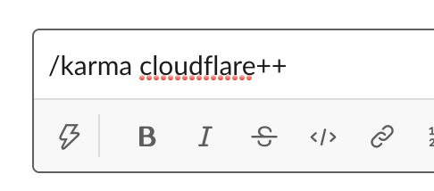
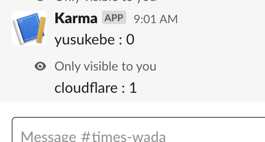
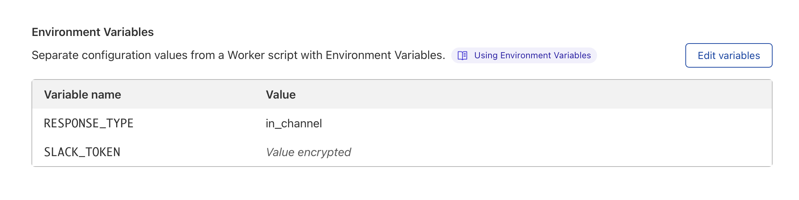

# karma-bot

Slack Bot on Cloudflare Workers. Its' about Karma.

## Description

It's a Slack Bot for slash command. You can increment or decrement a name such as name of Slack chennel member or product name or your lover.

Input:

```
/karma cloudflare++
```



Output:

```
cloudflare : 1
```



This application works on Cloudlare Workers. Values of Karma are stored in Cloudflare Workers KV.
You can deploy your own Cloudflare Workers project.

## Requirements

* Node.js
* wrangler <https://github.com/cloudflare/wrangler>

## Deployment

### With Deploy button

[](https://deploy.workers.cloudflare.com/?url=https://github.com/yusukebe/karma-bot)

Set environment variables on Cloudflare Workers web page.



### With wrangler

Git clone. Copy wrangler setting file.

```
$ git clone git@github.com:yusukebe/karma-bot.git
$ cd karma-bot
$ cp wrangler.exampl.toml wrangler.toml
```

Make namespace of Workers KV.

```
$ wrangler kv:namespace create "KV_KARMA"
$ wrangler kv:namespace create "KV_KARMA" --preview
```

Then, set `id` in `wrangler.toml`.

```
kv_namespaces = [
  {binding = "KV_KARMA", id = "your-id", preview_id = "your-preview-id  "},
]
```

Set a Slack Verification Token.

```
$ wrangler secret put SLACK_TOKEN
```

Publish to your Workers.

```
$ wrangler publish
```

Finally set your Workers URL `https://karma-bot.username.workers.dev` as Slack webhook URL.

By default, `/karma` command is working only you.
If you want to use `/karma` command for everyone on yor Slack channel, set `RESPONSE_TYPE` env var.
Edit `wrangler.toml`.

```
RESPONSE_TYPE = 'in_channel'
```


## License

MIT

## Author

Yusuke Wada <https://github.com/yusukebe>
